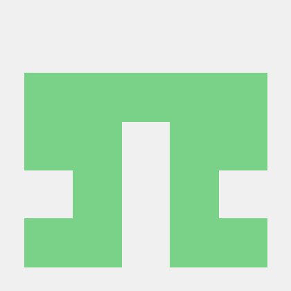

<div align="center">



# BenchCAD

**A benchmark for evaluating LLMs and multimodal models on programmatic CAD.**

[](https://arxiv.org/abs/2605.10865)
[](https://huggingface.co/datasets/BenchCAD/BenchCAD)
[](LICENSE)
[](https://creativecommons.org/licenses/by/4.0/)
[](https://www.python.org/)

[Paper](https://arxiv.org/abs/2605.10865) · [Dataset](https://huggingface.co/datasets/BenchCAD/BenchCAD) · [Contributing](CONTRIBUTING.md)

</div>

---

BenchCAD evaluates whether a model can *understand and write parametric CAD code*
— the [CadQuery](https://github.com/CadQuery/cadquery) programs that generate real
mechanical parts. It is built on **17,900 execution-verified CadQuery programs**
across **106 industrial part families** (bevel gears, compression springs, twist
drills, threaded adapters, …) drawn from **49 engineering standards** (ISO / DIN /
ASME). The benchmark decomposes model ability into four tasks (across three task
dirs — QA splits into a vision and a code variant) spanning perception,
parametric abstraction, and executable synthesis.

> **Scoring is execution-grounded and deterministic — there is no LLM judge.**
> Generation tasks grade by *voxel IoU* between the model's executed STEP solid and
> the ground-truth STEP; the QA task grades by *symmetric ratio accuracy* on numeric
> answers. Every score is reproducible by re-running the scorer, never model-judged.

## Tasks

| Task | Input → Output | Metric |
|---|---|---|
| **Vision2Code** (`Vision2Code/`) | rendered views of a part → a CadQuery program | voxel IoU vs ground-truth STEP |
| **CodeEdit** (`CodeEdit/`) | instruction (+ part) → edit an existing CadQuery program | normalized IoU (improvement over baseline) |
| **Vision-QA** (`QA/`, `mode: img`) | rendered views + a numeric question → a number | symmetric ratio accuracy |
| **Code-QA** (`QA/`, `mode: code`) | CadQuery code + a numeric question → a number | symmetric ratio accuracy |

## Why BenchCAD

- **Objective, execution-grounded labels.** Ground truth is real geometry; scores
  come from a CAD kernel, not an LLM judge or human vote — they can't be gamed by
  fluent-but-wrong outputs.
- **Multimodal.** Tasks probe code-only, vision-only, and combined reasoning.
- **Industry-standard parts.** Real mechanical families and standards, not toy primitives.
- **Reproducible.** Pinned environment, one-command runs, deterministic scoring.

## Installation

```bash
# Python 3.11, managed by uv (https://docs.astral.sh/uv/)
uv sync

# LLM API keys only — benchmark data is public
cp .env.example .env   # then paste OPENAI / ANTHROPIC / GEMINI / OPENROUTER keys
```

## Quick start

After `uv sync` and pasting a key into `.env`, one command runs everything:

```bash
# Smoke-run all three tasks (default `test` config, ~4 records each)
uv run python run_all.py

# The full benchmark — all three tasks, full split (one-time HF download per task)
uv run python run_all.py --config prod

# A reproducible random subset: 100 records per task, seed 42
uv run python run_all.py --config prod --limit 100 --seed 42

# A single task (one of: vision2code / codeedit / qa)
uv run python run_all.py --task vision2code --config prod
```

Flags: `--config` is the config *name* (`test` smoke / `prod` full), **not** a
number; `--limit N` caps to N records (first N, or a random N with `--seed S`);
`--seed S` makes the `--limit` sample reproducible.

`--config <name>` resolves to `<Task>/configs/<name>.yaml`. Each task is also
runnable on its own (`cd Vision2Code && uv run python main.py`); see the per-task
READMEs for options.

## Dataset

Hosted on HuggingFace at [`BenchCAD/BenchCAD`](https://huggingface.co/datasets/BenchCAD/BenchCAD)
and pulled into the gitignored `data/` folder on first `prod` run. One config per task:

| Task | Config | Size | Contents |
|---|---|---|---|
| Vision2Code | `code_gen` | 17,900 | GT CadQuery code + 4 rendered views per part (106 families) |
| CodeEdit | `edit-bench` | 748 | instruction-guided edit benchmark (held-out) |
| Vision-QA / Code-QA | `QA` | 2,400 | numeric questions over 200 parts (dimensions, counts, ratios); asked from the rendered image (`mode: img`) or the CadQuery code (`mode: code`) |

A tiny `test_data/` (≈4 records) is committed per task for smoke tests without any
download. Dataset schema and column details are documented on the dataset card.

## Scoring

| Task | How a prediction is graded |
|---|---|
| Vision2Code | the model's code is executed to a STEP solid, voxelized on a normalized 64³ grid, and compared to the ground-truth solid by voxel IoU (`|A∩B| / |A∪B|`) |
| CodeEdit | the same voxel IoU, **normalized** as the model's improvement over the unedited program toward the target: `(IoU_model − IoU_orig) / (1 − IoU_orig)`, clipped to `[0, 1]` |
| Vision-QA & Code-QA | each numeric answer is scored by `min(pred, gt) / max(pred, gt)`; exact match for counts / integers / yes-no (same metric for both the image and code variant) |

No external judge model is involved, so any submission can be re-graded to the
same number — see [`tools/regrade.py`](tools/regrade.py).

## Repository layout

```
BenchCAD/
├── run_all.py              one-click runner across all three tasks
├── pyproject.toml          shared, pinned environment
├── Vision2Code/  CodeEdit/  QA/    three task dirs — QA serves Vision-QA + Code-QA (mode: img / code)
├── tools/                  regrade / validate_task / validate_family / ingest_to_hf
└── contributions/          community-submitted parts (see CONTRIBUTING.md)
```

Each task subdir shares the same shape: `main.py`, `configs/{test,prod}.yaml`,
`pipeline/`, `scoring/`, `models/`, `test_data/`, `tools/download_*.py`, `README.md`.

## Contributing

See [CONTRIBUTING.md](CONTRIBUTING.md). You can contribute a new part/QA item, a
model's results (we re-grade raw predictions — numbers are never self-reported), or
code / errata fixes.

## Citation

```bibtex
@article{zhang2026benchcad,
  title  = {BenchCAD: A Comprehensive, Industry-Standard Benchmark for Programmatic CAD},
  author = {Zhang, Haozhe and Li, Lei and Peng, Cheng and Chen, Hanjie},
  year   = {2026},
  eprint = {2605.10865},
  archivePrefix = {arXiv}
}
```

## License

Code is released under the [MIT License](LICENSE); the dataset is released under
[CC BY 4.0](https://creativecommons.org/licenses/by/4.0/).
